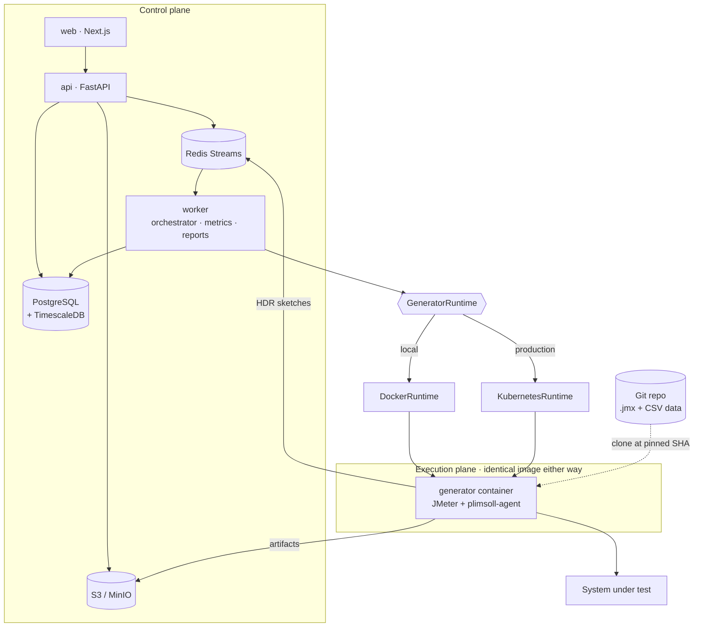

<h1 align="center">Plimsoll</h1>

<p align="center">
  <strong>Open-source performance-testing control plane.</strong><br>
  Orchestrate JMeter across many load generators, measure it correctly,<br>
  and gate your pipeline on the result.
</p>

<p align="center">
  <a href="LICENSE"></a>
  
</p>

---

> A ship's **Plimsoll line** is the mark on the hull showing the maximum load it
> can safely carry. That is what a performance SLA is, and it is what this
> project measures.

> [!WARNING]
> **Pre-alpha.** This repository currently contains the specification and no
> implementation. Nothing here runs yet. See [the roadmap](docs/roadmap.md) for
> what is being built and in what order.

## What it is

Load-generation engines are a solved problem — JMeter, k6, Gatling, and Locust
are all excellent. What is still missing from the open-source world is the layer
*above* them: the shared control plane that teams actually run a performance
practice on.

Plimsoll is that layer. It keeps your test assets in Git, provisions load
generators as containers, streams results back in real time, evaluates them
against SLAs, compares them against a baseline, and reports pass or fail to your
pipeline.

**Plimsoll does not implement a virtual-user engine.** It drives Apache JMeter,
and the executor interface is designed so other engines can be added without
touching the control plane.

## Why it exists

| Problem | What Plimsoll does |
| --- | --- |
| Test plans drift from the code they test | Plans live in Git; every run pins a commit SHA |
| Distributed JMeter reports wrong percentiles | Merges HDR histograms instead of averaging per-node percentiles |
| Load generators are pets that must be provisioned and babysat | Generators are ephemeral containers or Kubernetes pods, created per run |
| "Is this release slower?" is answered by opinion | Baselines and diffed runs answer it with numbers |
| Performance testing sits outside CI | An API-triggered run returns a pass/fail your pipeline can block on |

### The percentile problem, specifically

If two load generators each report a p95 of 800 ms, the combined p95 is **not**
800 ms — and it is not their average either. Percentiles are not linear, so no
arithmetic on them recovers the true value. Tools that average per-node
percentiles silently misreport the exact number most teams put in their SLA.

Plimsoll has each agent fold raw samples into an
[HDR histogram](http://hdrhistogram.org/), ships the mergeable sketch rather
than a summary, and computes percentiles once from the merged histogram. The
answer is correct by construction.

## Architecture



The control plane and execution plane are strictly separated: the API never runs
virtual users, and a long test can never block it.

## Quickstart

> Partly functional. The control plane defines and validates tests today;
> executing them, and the web interface at `:3000`, are still being built.

```bash
git clone https://github.com/ultron13/bonerepo.git
cd bonerepo
make dev
```

One command, no Kubernetes required: six control-plane containers plus a small
bundled demo target. `make dev` seeds a demo project with a JMeter plan — and a
target-policy allowlist entry for the bundled target, since an empty allowlist
permits no runs — so there is something to run, and something it is allowed to
hit, immediately. It also starts a small Git server holding the demo plan, so
nothing on this path depends on reaching the internet.

### Take the demo from Git to a validated test

Sign in as the seeded administrator:

```bash
TOKEN=$(curl -sX POST http://localhost:8000/api/v1/auth/login \
  -H 'content-type: application/json' \
  -d '{"email":"admin@demo.plimsoll.dev","password":"plimsoll-demo-password"}' \
  | jq -r .accessToken)
AUTH="authorization: Bearer $TOKEN"
```

Find the seeded script repository and verify it. `verify` resolves the ref,
reads the plan and its `plimsoll.yaml`, and reports every finding at once:

```bash
PROJECT=$(curl -s -H "$AUTH" 'http://localhost:8000/api/v1/projects?limit=200' \
  | jq -r '.items[] | select(.projectKey=="DEMO") | .id')
REPO=$(curl -s -H "$AUTH" "http://localhost:8000/api/v1/projects/$PROJECT/script-repos" \
  | jq -r '.items[0].id')

curl -sX POST -H "$AUTH" "http://localhost:8000/api/v1/script-repos/$REPO/verify" | jq
```

Pin the branch to the commit it currently names. Repeating this returns the same
version rather than a second one — a commit SHA is immutable, so pinning it
twice describes the same thing:

```bash
curl -sX POST -H "$AUTH" -H 'content-type: application/json' \
  -d '{"ref":"main"}' \
  "http://localhost:8000/api/v1/script-repos/$REPO/versions" | jq '{commitSha, checksum}'
```

Ask whether the seeded test will actually run:

```bash
TEST=$(curl -s -H "$AUTH" "http://localhost:8000/api/v1/projects/$PROJECT/tests" \
  | jq -r '.items[] | select(.name=="Demo checkout test") | .id')

curl -sX POST -H "$AUTH" "http://localhost:8000/api/v1/tests/$TEST/validate" | jq
```

The answer is a list of checks, not a single yes or no, and every one of them
runs: the plans add up to the workload, each ref resolves, each plan parses,
every variable it references has a stored value, every target host it reaches is
inside the allowlist, and the pool has the capacity. To watch it refuse, point
the plan's `API_HOST` variable somewhere the allowlist does not permit and
validate again — `TARGET_ALLOWED` fails and names the host.

Locally, generators are Docker containers. In production the same image runs as
Kubernetes pods. Only the launcher differs — see
[ADR-0003](docs/adr/0003-kubernetes-native-generators.md).

## Documentation

| | |
| --- | --- |
| [Architecture overview](docs/architecture/01-overview.md) | Start here |
| [Execution plane](docs/architecture/02-execution-plane.md) | Runtimes, agent, run lifecycle |
| [Metrics pipeline](docs/architecture/03-metrics-pipeline.md) | JTL → histogram → merge → UI |
| [Data model](docs/architecture/04-data-model.md) | Schema and tenancy |
| [Security](docs/architecture/05-security.md) | Auth, secrets, target policy |
| [API](docs/architecture/06-api.md) | REST and WebSocket surface |
| [Script repositories](docs/architecture/07-script-repos.md) | The contract for the repo holding your `.jmx` plans |
| [Decision records](docs/adr/) | Why things are the way they are |
| [Roadmap](docs/roadmap.md) | Scope per release |

## Contributing

Contributions are welcome, and the pre-alpha stage is the best time to influence
the design. Start with [CONTRIBUTING.md](CONTRIBUTING.md); argue with the
[ADRs](docs/adr/) if you disagree with them — that is what they are for.

Please report security issues privately per [SECURITY.md](SECURITY.md) rather
than in a public issue.

## Responsible use

Plimsoll generates real traffic against real systems. Directing it at
infrastructure you are not authorised to test is an attack, and in most
jurisdictions a crime. Plimsoll enforces an explicit target policy and records
who started every run — see [SECURITY.md](SECURITY.md). Do not remove those
controls to test something you do not own.

## License

[Apache License 2.0](LICENSE).

Plimsoll is an independent open-source project. It is not affiliated with,
endorsed by, or derived from OpenText, Micro Focus, or the LoadRunner product
family. Apache JMeter is a trademark of the Apache Software Foundation.
