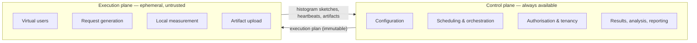
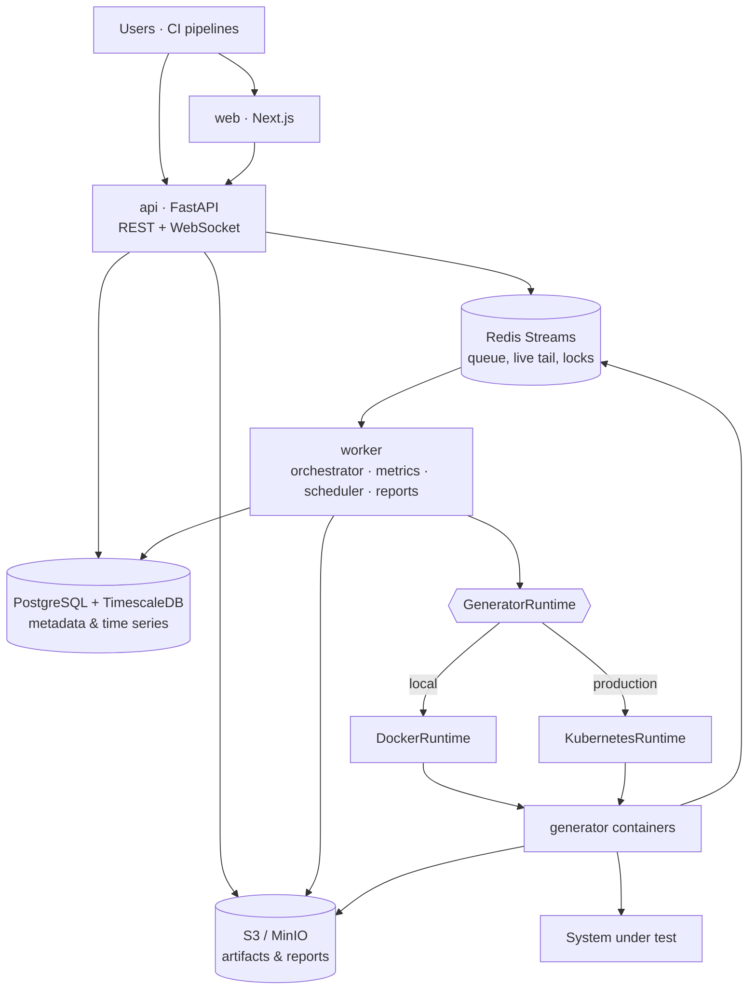

# 1. Architecture overview

**Read this first.** Everything else in `docs/architecture/` assumes it.

## What Plimsoll is

A centralised control plane for performance testing. Teams register Git
repositories containing JMeter test plans, define performance tests against
them, run those tests across ephemeral containerised load generators, watch
results stream in live, evaluate them against SLAs, compare them to baselines,
and trigger the whole thing from CI.

## What Plimsoll is not

Plimsoll does **not** implement a virtual-user engine. Apache JMeter does that,
and does it better than a new project would. Plimsoll orchestrates, measures,
stores, analyses, and reports.

This is the central strategic decision. The open-source ecosystem has excellent
load-generation engines and no good shared control plane. Building another
engine would compete where the field is strongest and leave the actual gap
unfilled. See [ADR-0006](../adr/0006-jmeter-first-executor.md).

## The two planes

Separating these is the most important structural decision in the system.
It means a thirty-minute test at 5,000 virtual users cannot slow down, block, or
crash the API that people are using to look at last week's results.

The control plane treats the execution plane as **untrusted and unreliable**.
Generators disappear, restart, duplicate messages, and report late. Heartbeats,
idempotency, timeouts, and state reconciliation are therefore mandatory rather
than defensive extras.

## Component map

A **modular monolith plus separately deployable workers** — not microservices.
One API application, one worker application, one agent. Modules have real
internal boundaries (`api → service → repository → model`) so components can be
extracted later without redesigning the domain.

## Functional modules

Authentication · users · organisations · projects · script repositories · script
versions · performance tests · workload modelling · generator pools · scheduling
· execution · runtime monitoring · metrics collection · transaction analytics ·
results · baselines · SLA engine · reports · dashboard · notifications · audit
log · REST API · CI/CD integration · administration.

Not all ship at once. See [the roadmap](../roadmap.md) for what lands when.

## Technology

| Layer | Choice | Note |
| --- | --- | --- |
| Frontend | React, TypeScript, Next.js, Tailwind, shadcn/ui | |
| Server state | TanStack Query | Not Redux |
| Charts | ECharts | Recharts for simple cards |
| Backend | Python 3.12+, FastAPI, SQLAlchemy 2.0, Pydantic v2 | |
| Migrations | Alembic | Never hand-edit production schema |
| Database | PostgreSQL 16 | |
| Time series | TimescaleDB **extension** on the same instance | Not a second database — [ADR-0005](../adr/0005-redis-streams-over-rabbitmq.md) |
| Queue & cache | Redis Streams | Behind a `MessageBus` interface |
| Object storage | S3-compatible; MinIO locally | Artifacts and reports only |
| Load engine | Apache JMeter | Apache-2.0, no licence friction |
| Agent | Python | Ships in the generator image |
| Runtimes | Docker locally, Kubernetes in production | Identical image |
| Observability | OpenTelemetry, Prometheus, Grafana | Opt-in dev profile |
| Tests | pytest, Vitest, Playwright | |

## Local footprint

`make dev` starts **six** control-plane containers — `postgres`, `redis`,
`minio`, `api`, `worker`, `web` — plus `demo-target`, a small bundled web
application the seeded demo project is authorised to load test. The target
policy has no permit-all state ([security](05-security.md)), so the demo ships
its own system under test with a seeded allowlist entry; without it, a new
user's first run would fail on policy. `demo-target` is demo workload, not a
control-plane service, and sits outside the six-container budget of
[ADR-0005](../adr/0005-redis-streams-over-rabbitmq.md). Generator containers
are created on demand and removed after each run.

The observability stack is an opt-in `--profile observability`. Contributor
onboarding is treated as a first-class constraint: a heavyweight default stack
costs more contributors than the missing dashboards are worth.

## Governing principles

1. **Never run virtual users in the API process.** Enqueue, orchestrate,
   execute — three separate places.
2. **Never use PostgreSQL as a high-volume metric event bus.** Aggregate at the
   agent, ship sketches, write aggregates.
3. **Every run gets an immutable configuration snapshot**, including resolved
   commit SHAs. Historical results must be reproducible.
4. **Separate the control plane from the execution plane.**
5. **Build the executor abstraction before the second executor**, but validate
   it with a real one first.
6. **Metrics share one schema** regardless of engine, so the UI never learns
   what JMeter is.
7. **Never couple screens to database models.** `Database → repository →
   service → DTO → frontend`.
8. **Asynchronous jobs** for reports, imports, execution, aggregation, and
   notifications.
9. **API-first.** Anything the UI can do, the API can do.
10. **Treat generators as untrusted remote workers.**

## Definition of architectural success

> A user can define a performance test against a JMeter plan in a Git
> repository, model a workload, run it across distributed containerised
> generators, watch it in real time, get correctly-merged percentiles, evaluate
> SLAs, compare against a baseline, generate a report, and trigger the identical
> process from CI.

Everything else — more protocols, more integrations, AI analysis — comes after.
