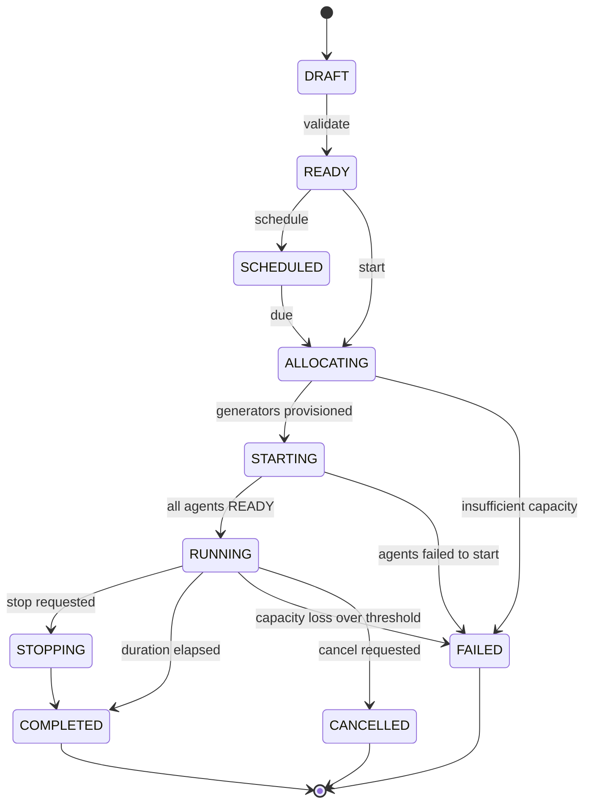

# 2. Execution plane

How a test becomes running virtual users, and how it stops cleanly.

## Generator runtimes

Generators are **ephemeral containers created per run**, never long-lived
registered hosts. One interface, two implementations:

```python
class GeneratorRuntime(Protocol):
    def provision(self, plan: ExecutionPlan) -> list[GeneratorHandle]: ...
    def status(self, handles: list[GeneratorHandle]) -> list[GeneratorStatus]: ...
    def teardown(self, handles: list[GeneratorHandle]) -> None: ...
```

| | `DockerRuntime` | `KubernetesRuntime` |
| --- | --- | --- |
| Used for | Local development, small deployments | Production |
| Creates | Containers via the Docker socket | A `Job` with `parallelism: N` |
| Admission control | Host resources | Namespace `ResourceQuota` |
| Isolation | Container limits | Pod limits, `NetworkPolicy`, node selectors |
| Cleanup | Explicit removal after artifact upload | `ttlSecondsAfterFinished` + finalizer |

The **generator image is identical** in both. Only the launcher differs, which
is what keeps the local experience honest — a contributor running `make dev`
exercises the same agent, the same JMeter invocation, and the same metrics path
as production.

### Kubernetes specifics

- `restartPolicy: Never`. A restarted generator resets virtual-user state
  mid-test and silently corrupts the run. Pod loss must surface as capacity
  loss, never be papered over by the scheduler.
- `parallelism` equals generator count; `completions` equals the same.
- Pod identity comes from the downward API. Each pod learns its ordinal and
  receives a short-lived, run-scoped token — not a long-lived registration
  secret.
- A finalizer holds teardown until artifacts are uploaded, so a completed run
  never loses its JTL to a fast garbage collector.

Kubernetes already answers "which host has capacity?", so Plimsoll does not
reimplement it. There is no Redis-based capacity lock and no admin-provisioned
agent token in the normal path. See
[ADR-0003](../adr/0003-kubernetes-native-generators.md).

## Generator pools

A pool describes *where* generators can be created and the ceiling on them.

```
generator_pool
  runtime: docker | kubernetes
  config:  namespace, kubeconfig ref, node selector, image, resource requests
  max_generators
  max_vus_per_generator
```

`max_vus_per_generator` is per-engine and must be set honestly. **JMeter
allocates an OS thread per virtual user**, so a realistic ceiling is roughly
500–2,000 VUs per generator depending on heap and plan weight — not the 5,000
a goroutine-based engine could sustain. A 50,000-VU test therefore implies
roughly 25–50 generators. Capacity is `generators × max_vus_per_generator`,
declared by the pool, never assumed globally.

## The agent

`plimsoll-agent` runs inside every generator container and owns the local
lifecycle:

1. **Register** with the control plane using its run-scoped token and ordinal.
2. **Fetch the plan** — shallow, sparse `git clone` at the pinned commit SHA.
   CSV data files, `.properties`, and the `plimsoll.yaml` manifest resolve by
   relative path because they sit beside the `.jmx` in the repository
   ([script repositories](07-script-repos.md)). Plugins named in the manifest
   must already be present in the generator image or the organisation's plugin
   mirror — the agent never downloads plugins from the internet at run time.
3. **Resolve secrets** — variables injected in memory, never written to disk.
4. **Verify the target** against the policy a second time, immediately before
   traffic starts.
5. **Run JMeter** headless:
   `jmeter -n -t <plan>.jmx -l results.jtl -Jthreads=<n> -Jrampup=<s> -Jduration=<s>`
   Workload parameters are passed as properties; the plan is never rewritten.
6. **Stream measurements** — tail the JTL sample stream, fold into HDR
   histograms, ship sketches. See [the metrics pipeline](03-metrics-pipeline.md).
7. **Heartbeat** every 10 seconds over the control channel.
8. **Upload artifacts** — raw JTL, JMeter logs, and errors to object storage.
9. **Report terminal state** and exit.

Agent states: `STARTING → FETCHING → READY → RUNNING → STOPPING → COMPLETED`,
with `FAILED` reachable from any of them.

Communication is **outbound only**, over TLS, via WebSocket to the control
plane. Generators in a locked-down network never need inbound connectivity.

## Workload model

A performance test combines plans, workload, duration, ramp, generators,
thresholds, and environment.

Supported at v0.1: **virtual users** and **percentage split**. Throughput and
arrival-rate models come later.

```
Total: 5,000 VUs          Login      10%    500
                          Browse     50%  2,500
                          Add cart   25%  1,250
                          Checkout   15%    750
                                    ────  ─────
                                    100%  5,000
```

Percentages must sum to 100 — validation rejects anything else rather than
silently normalising.

**Distribution across generators:** even, weighted, capacity-based, or manual.
Even is the default. The remainder from an uneven division is distributed one
VU at a time to the earliest generators, so totals always reconcile exactly.

**Ramp profiles.** Linear ramp-up and ramp-down are stock JMeter Thread Group
behaviour and ship at v0.1. Step, spike, and custom profiles require the
`jpgc-casutg` Custom Thread Groups plugin, and are marked plugin-dependent
rather than pretended to be universal.

Think time maps to JMeter Timers; pacing maps to Constant Throughput Timer;
parameterisation maps to CSV Data Set Config; transactions map to Transaction
Controllers.

## Execution plan

Produced once, immutable, snapshotted onto the run:

```json
{
  "runId": "run-2026-000123",
  "duration": 1800,
  "rampUp": 600,
  "rampDown": 300,
  "plans": [
    {
      "repo": "git@github.com:acme/checkout.git",
      "commitSha": "9f4c1e2a7b3d5e8f1a2b3c4d5e6f7a8b9c0d1e2f",
      "path": "perf/checkout.jmx",
      "users": 1000
    }
  ],
  "pool": "k8s-eu-west",
  "generators": [
    { "ordinal": 0, "users": 500 },
    { "ordinal": 1, "users": 500 }
  ],
  "slaRules": [ "..." ],
  "targetPolicyVersion": 7
}
```

The pinned `commitSha` is what makes historical runs reproducible. A branch
moving mid-run cannot change what executed.

## Run state machine



## Preflight validation

A run cannot start until all of these pass, and failures are reported together
with actionable messages rather than one at a time:

- Test references at least one plan, and each `ref` resolves to a commit
- Workload percentages sum to 100 and total VUs is greater than zero
- Pool capacity ≥ requested VUs
- Target hosts pass the [target policy](05-security.md)
- Required variables and secrets resolve
- SLA rules reference metrics that exist
- Target reachable: DNS → TCP → TLS → HTTP

Failing preflight leaves the run in `FAILED` with structured details, not a
generic error.

## Stopping and cancellation

```
stop requested → status STOPPING → agents signalled → VUs wind down
  → final sketches flushed → artifacts uploaded → generators torn down
  → status COMPLETED (stop) or CANCELLED (cancel)
```

`stop` requests a graceful wind-down and keeps results. `cancel` abandons the
run. Both are **idempotent**: stopping a stopped run returns `200` and does
nothing further.

## Failure handling

A generator can vanish at any moment. Heartbeat timeout marks it lost, and the
orchestrator computes capacity loss as a percentage of planned virtual users:

| Capacity lost | Default behaviour |
| --- | --- |
| Below threshold (default 10%) | Continue, record a run warning, annotate results |
| At or above threshold | Fail the run |

Configurable per test. Runs that continue degraded are marked as such — a result
produced with 82% of the intended load must never be silently compared against a
baseline produced with 100%.
