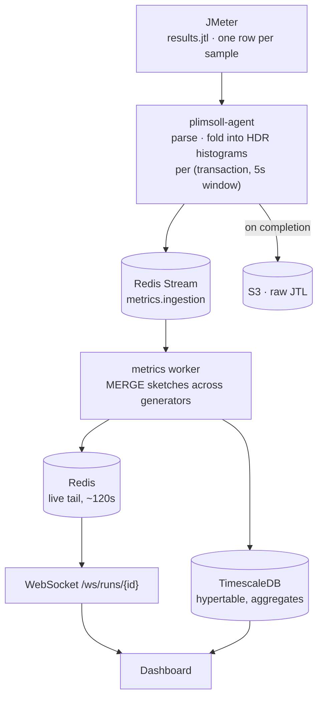

# 3. Metrics pipeline

From a JMeter sample to a number on a dashboard, without lying about it.

## The problem this pipeline exists to solve

Two generators each report a p95 of 800 ms. What is the combined p95?

It is **not** 800 ms, and it is not the average of the two. Percentiles are
order statistics, not linear quantities — no arithmetic on summarised
percentiles recovers the true value. The error is not small either: it depends
on the shapes of the underlying distributions, which is exactly the information a
percentile throws away. Averaging is systematically wrong in an unpredictable
direction.

This matters because p95 is the number most teams put in their SLA. A load
testing tool that gets it wrong is worse than no tool, because it produces
confident wrong answers.

**The fix:** never summarise before merging. Agents ship *mergeable sketches*;
percentiles are computed once, at the end, from the merged distribution.

## Metric kinds

Every metric declares how it combines across generators. This is what makes
correctness mechanical rather than a matter of remembering.

| Kind | Examples | Merge rule |
| --- | --- | --- |
| `counter` | requests, errors, bytes | Sum |
| `gauge` | active virtual users | Sum across generators; last value within a generator |
| `histogram` | response time, latency, transaction duration | **Merge sketches**, then derive percentiles |

Deriving a percentile from anything other than a merged `histogram` is a bug.
The aggregation layer has no code path that accepts a pre-computed percentile
from a generator.

## Pipeline



### Why aggregate at the agent

At 5,000 virtual users a run produces millions of samples. Shipping raw samples
to the control plane would make the network the bottleneck and the database the
next one. The agent folds samples into histograms locally and emits one small
sketch per transaction per window. Bandwidth becomes a function of *transaction
count*, not request count — flat as load grows.

Raw per-sample fidelity is not lost: the complete JTL is uploaded to object
storage for deep-dive analysis and re-processing.

## HDR histograms

[HDR histograms](http://hdrhistogram.org/) record values in bucketed form at
configurable precision, and two histograms over the same range merge by adding
their bucket counts. Merging is associative and order-independent, so it works
across any number of generators arriving in any order.

- Range: 1 µs to 1 hour
- Precision: 3 significant figures (~0.1% error at any magnitude)
- Wire format: the standard compressed HDR encoding, base64 in the message
  envelope — a documented cross-language format, not a bespoke one

The precision trade is worth stating plainly: sketches are **not exact**.
A p95 is accurate to about 0.1% of its value. That is far better than the
error introduced by averaging, and unlike averaging the error is bounded and
known.

## Aggregation windows

Agents emit at a 5-second base window. The worker writes the base window and
TimescaleDB continuous aggregates roll it up:

| Window | Retention | Use |
| --- | --- | --- |
| 5 s | 7 days | Live dashboard, fine-grained analysis |
| 1 min | 180 days | Run comparison, trends |
| 5 min | 2 years | Long-term capacity trends |

Each window stores `count`, `error_count`, `min`, `max`, `sum`, and the merged
histogram sketch. Percentiles are derived from the sketch on read, never stored
as the source of truth — which means a percentile that was never requested at
run time can still be computed accurately later.

## Common metric schema

Engine-independent, so the UI never learns what JMeter is:

```sql
CREATE TABLE performance_metrics (
    time          TIMESTAMPTZ      NOT NULL,
    run_id        UUID             NOT NULL,
    metric_name   VARCHAR(255)     NOT NULL,
    metric_kind   VARCHAR(20)      NOT NULL,  -- counter | gauge | histogram
    entity_type   VARCHAR(100),               -- transaction | generator | run
    entity_id     VARCHAR(255),
    value         DOUBLE PRECISION,           -- counters and gauges
    sketch        BYTEA,                      -- histograms
    tags          JSONB
);

SELECT create_hypertable('performance_metrics', 'time');
```

Exactly one of `value` or `sketch` is populated, determined by `metric_kind`.

## Live streaming

The worker writes merged windows to a short Redis tail (~120 seconds) and the
API fans out over `/ws/runs/{runId}`. Target latency from sample to pixel is
under 2 seconds.

WebSocket events: `run.started`, `run.running`, `metric`, `transaction.metric`,
`generator.status`, `sla.violation`, `run.warning`, `run.failed`,
`run.completed`.

Run-terminal events invalidate the corresponding TanStack Query caches so the UI
converges without polling.

## Transaction and error detail

**Individual transaction rows are not stored in PostgreSQL at v0.1.** A
30-minute run at 5,000 VUs generates hundreds of millions of them; storing each
one recreates the exact anti-pattern the architecture forbids.

Instead:

- **Aggregates** — per transaction, per window, in TimescaleDB
- **Errors** — grouped by `(error_code, message fingerprint, transaction)` with
  count, first seen, last seen, affected generators, and a bounded sample of
  full detail
- **Raw** — the complete JTL in object storage, downloadable and re-processable

Per-transaction drill-down in the UI arrives in v0.2 backed by the raw artifacts,
not by a transaction table.

## Infrastructure metrics

Generator CPU, memory, disk, and network are collected by the agent and enter
the same pipeline with `entity_type = 'generator'`, so a chart of response time
against generator CPU is a single query. Saturated generators are a common cause
of apparently slow targets, and the platform should make that visible rather
than let it be mistaken for a regression.

Target-side metrics arrive through monitor plugins — Prometheus and
OpenTelemetry first — normalised into the same schema.

## SLA evaluation

Rules are evaluated at run completion against merged data, never against a
single generator's view:

```json
{
  "metric": "transaction.p95",
  "entity": "Checkout",
  "operator": "<=",
  "value": 2000,
  "unit": "ms",
  "severity": "critical"
}
```

Outcome is `PASS`, `WARNING`, or `FAIL` per rule; the run takes the worst.
Runs that finished with degraded capacity are flagged, and a degraded run cannot
be promoted to a baseline.

## Baselines and comparison

A completed run can be marked a baseline. Comparison diffs merged aggregates:

| Metric | Baseline | Current | Change |
| --- | --- | --- | --- |
| Checkout p95 | 1,820 ms | 2,150 ms | **+18.1%** |
| Login p95 | 650 ms | 610 ms | −6.2% |
| Error rate | 0.4% | 1.2% | **+200%** |
| Throughput | 810 TPS | 790 TPS | −2.5% |

Regressions are highlighted, and never by colour alone — status carries an icon
and text for accessibility and for anyone reading a printed report.
