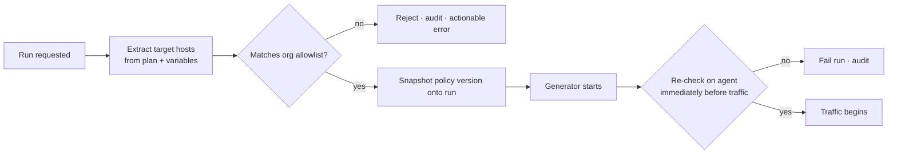

# 5. Security architecture

The reporting policy and responsible-use statement live in
[SECURITY.md](../../SECURITY.md). This document covers how the controls work.

## Threat model

Plimsoll is unusual: its normal operation is indistinguishable from an attack
except by authorisation. Three properties follow.

1. **The platform can be weaponised.** A distributed, API-triggerable,
   schedulable traffic generator pointed at a system you do not own is a DDoS
   tool. Target authorisation is a core feature, not a compliance checkbox.
2. **Test plans are untrusted input.** A `.jmx` is executable configuration
   supplied by a user, running in a container that holds credentials. Treat it
   as hostile.
3. **Generators are untrusted workers.** They run outside the control plane's
   trust boundary, can be lost or duplicated, and must never be able to escalate
   into it.

## Target policy

The control that separates a load test from an attack.



- Allowlists hold hostnames, domain suffixes, and CIDR ranges per organisation.
- **Empty allowlist means no runs.** There is no implicit permit-all state, and
  no first-run convenience exception.
- The seeded demo is not an exception either: `make dev` allowlists exactly one
  host — the bundled `demo-target` container. The first-run experience works
  because the demo ships its own permitted system under test, not because the
  check is soft.
- Checked twice — at run creation and on the agent — so a DNS record repointed
  between admission and execution does not slip through.
- Loopback, link-local, and cloud metadata endpoints (`169.254.169.254`) are
  blocked from generator containers regardless of allowlist, enforced by
  `NetworkPolicy` under Kubernetes and by network configuration under Docker.
- The policy version in force is snapshotted onto the run, so an audit can
  reconstruct what was permitted at the time.

Operators can widen the policy for a closed network. Disabling it on an
internet-reachable deployment turns the installation into an open attack proxy
and is not a supported configuration.

## Plan static analysis

A `.jmx` can execute arbitrary code — JSR223 and BeanShell scripts, the OS
Process Sampler, JDBC samplers — with whatever privileges the generator holds.
Generator isolation is the enforcement boundary; static analysis (v0.2) is the
layer that lets humans and policy act *before* execution:

- `verify` flags risky elements in its report: script samplers, process
  execution, JDBC, file access.
- Each organisation sets an **element policy** — allow, warn, or deny per
  element class. A denied element fails verification and preflight, and the
  rejection is audited like a target-policy rejection.
- Analysis is defence-in-depth, not the boundary. A plan that passes it still
  runs as hostile input inside an isolated generator.

## Authentication

| Principal | Mechanism |
| --- | --- |
| Users | JWT access token (short-lived) + rotating refresh token |
| CI and automation | API keys, `plim_live_*` / `plim_test_*` |
| Generator agents | Short-lived, run-scoped token, single run, expires with it |
| Enterprise | OIDC (v0.3); SAML and LDAP (v1.0) |

Passwords use **Argon2id**. API keys are stored as SHA-256 hashes and displayed
once; a leaked key is revoked, never recovered. Refresh tokens rotate on use, and
reuse of a consumed refresh token revokes the family — that is how token theft
is detected.

Agent tokens are the notable improvement over a host-registration model: there
is no long-lived shared secret sitting on a generator waiting to be stolen,
because generators do not outlive their run.

## Authorisation

Enforced server-side on every request. The frontend consults permissions only to
decide what to render — hiding a control is not access control.

```python
# API layer
authorize(principal, "test.execute", project_id=test.project_id)
```

Backed by row-level security in PostgreSQL ([data model](04-data-model.md)), so
a missing filter fails closed rather than leaking. Client-supplied
`organization_id` values are never trusted; the value comes from the
authenticated principal.

## Secrets

- Plans reference variables (`${DB_PASSWORD}`); they never contain credentials.
- Resolution happens at run start, injected into the generator **in memory** —
  not written to disk, not baked into an image, not passed on a command line
  where `ps` would show it.
- Storage is encrypted at rest with an external key: Vault, AWS Secrets Manager,
  Azure Key Vault, or Kubernetes Secrets depending on deployment.
- Artifacts and logs are scrubbed of resolved secret values before upload.
- Secrets are never returned by the API, only referenced by ID.

## Generator isolation

- Non-root user, read-only root filesystem, no added capabilities.
- CPU and memory limits per generator, so one run cannot starve another.
- `NetworkPolicy` restricting egress to allowlisted targets and the control
  plane.
- No cloud metadata access — otherwise a malicious plan could exfiltrate the
  node's IAM role.
- Run-scoped credentials only. A compromised generator can affect its own run
  and nothing else.

## Transport and API hardening

TLS 1.2 or better everywhere, including agent traffic. Agents connect
**outbound only**, so no inbound path into the generator network is required.

Rate limiting per principal and per organisation · strict request validation via
Pydantic · CORS allowlist · security headers (HSTS, CSP, `X-Content-Type-Options`)
· CSRF protection on cookie-authenticated routes · parameterised SQL only,
never f-string interpolation · structured audit logging of every state change.

## Supply chain

Dependencies pinned with hashes. CI runs `pip-audit`, `npm audit`, Trivy on
images, and Semgrep on source. Container images are built from pinned base
digests and published with provenance attestation. Commits require DCO sign-off.

## Deliberate non-goals for v0.1

Stated plainly so nobody assumes otherwise: no OIDC or SAML, no HSM-backed key
management, no per-field encryption beyond the credentials table, no FIPS mode.
These are [roadmap](../roadmap.md) items. The controls that *are* present from
v0.1 — target policy, RLS tenancy, Argon2id, hashed API keys, encrypted
credentials, audit logging — are the ones whose absence would be unsafe rather
than merely inconvenient.
