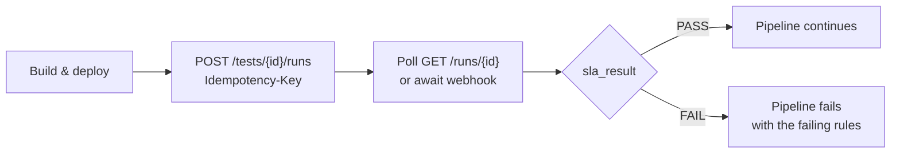

# 6. API

Base path `/api/v1`. OpenAPI at `/api/openapi.json`, Swagger UI at `/api/docs`,
generated by FastAPI.

**API-first:** anything the UI can do, the API can do. The UI is a client of the
same endpoints, with no privileged back channel.

## Versioning

`v1` contracts do not break. Additive change only — new optional fields, new
endpoints, new enum values that clients may ignore. Breaking change means `v2`
alongside `v1`, with a documented migration window.

## Authentication

```http
Authorization: Bearer <jwt>          # interactive users
Authorization: Bearer plim_live_...  # API keys, for CI and automation
```

## Error format

One shape everywhere:

```json
{
  "error": {
    "code": "TEST_NOT_RUNNABLE",
    "message": "No generator pool has sufficient capacity.",
    "details": { "requiredUsers": 5000, "availableUsers": 3200 },
    "requestId": "req-8f2a1c"
  }
}
```

`code` is stable and machine-readable. `message` is written for a human who has
to fix it — it says what happened and what to do, not just that something went
wrong. `requestId` correlates to logs and traces.

Validation failures return **all** problems at once. Fixing one field at a time
across seven round trips is a bad experience and worse in CI.

### Error codes

`code` values are part of the `v1` contract: append-only, never renamed, never
repurposed. The v0.1 catalogue:

| Code | HTTP | Meaning |
| --- | --- | --- |
| `VALIDATION_FAILED` | 422 | Request shape or field values invalid; `details` lists every problem |
| `UNAUTHENTICATED` | 401 | Missing or invalid credentials |
| `PERMISSION_DENIED` | 403 | Authenticated, but not permitted to do this |
| `NOT_FOUND` | 404 | Absent — or outside the caller's organisation, indistinguishable by design |
| `METHOD_NOT_ALLOWED` | 405 | The path exists, but not for this method |
| `CONFLICT` | 409 | Optimistic-lock `version` mismatch on a concurrent edit, or a uniqueness clash |
| `RESOURCE_IN_USE` | 409 | Another resource references this one and it cannot be deleted; `details` names the referents |
| `IDEMPOTENCY_KEY_REUSED` | 409 | Same `Idempotency-Key`, different payload |
| `TEST_NOT_RUNNABLE` | 422 | A run was requested for a test that fails preflight; `details` carries every failing check. `POST /tests/{id}/validate` never returns this — it answers `200` with the report |
| `TARGET_NOT_ALLOWED` | 422 | A resolved target host is outside the organisation's allowlist |
| `INSUFFICIENT_CAPACITY` | 422 | No generator pool can supply the requested virtual users |
| `REPO_UNREACHABLE` | 422 | Git host or credential failure during verify or ref resolution |
| `RATE_LIMITED` | 429 | Limit exhausted; honour `Retry-After` |
| `INTERNAL` | 500 | Unexpected fault; `requestId` is the support handle |

## Collections

Every list endpoint pages with an opaque cursor:

```http
GET /api/v1/runs?limit=50&cursor=eyJydW4iOi...
```

```json
{ "items": [ "..." ], "nextCursor": "eyJydW4iOi..." }
```

- `limit` defaults to 50, capped at 200. `nextCursor` is `null` on the last
  page. Cursors are opaque; clients never construct or parse one.
- Cursor pagination rather than offset, because run history grows without
  bound and offset pagination skips or duplicates rows when inserts land
  mid-scan — which, on a busy control plane, is always.
- Filters are per-endpoint query parameters combined with AND:
  `GET /runs?status=RUNNING&projectId={id}&since=2026-08-01T00:00:00Z`.
- `sort` takes a documented field name, `-`-prefixed for descending. The
  default is newest first.

## Endpoints

### Auth
```http
POST /auth/login
POST /auth/logout
POST /auth/refresh
GET  /auth/me
```

### Projects
```http
GET    /projects
POST   /projects
GET    /projects/{id}
PATCH  /projects/{id}
DELETE /projects/{id}
```

### Credentials
```http
GET    /credentials
POST   /credentials
DELETE /credentials/{id}
```

A credential is written once and never read back: the response carries id,
name, kind, and creation time, and no endpoint returns the secret. There is
deliberately no `GET /credentials/{id}` — a per-credential read is where a
"reveal" parameter would eventually be added. Deleting one that a script
repository still references returns `RESOURCE_IN_USE`.

### Script repositories
```http
GET    /projects/{projectId}/script-repos
POST   /projects/{projectId}/script-repos
GET    /script-repos/{id}
PATCH  /script-repos/{id}
DELETE /script-repos/{id}

POST   /script-repos/{id}/verify        # test credentials, resolve ref, read plan
GET    /script-repos/{id}/versions      # resolved commits
POST   /script-repos/{id}/versions      # pin a ref to a commit SHA
GET    /script-versions/{id}
```

`verify` is the endpoint that makes Git-sourced plans usable: it confirms the
credential works, resolves the ref, and reports what it found — thread groups,
transaction controllers, referenced data files, required plugins — before anyone
tries to run it. Validation runs against the repository's `plimsoll.yaml`
manifest where present; [script repositories](07-script-repos.md) defines the
contract.

`verify` reports; it does not reject. A reachable repository returns `200` with
every finding at once, each one a `code`, a `severity`, and a message, so a
tester fixes the set rather than discovering them one request at a time.
`REPO_UNREACHABLE` is reserved for not reaching Git at all — an unknown host, a
credential Git refuses, or a ref that does not resolve.

`POST /script-repos/{id}/versions` pins a ref to the commit it names. It is
idempotent: pinning a commit already pinned for the same plan path returns `200`
and the existing version rather than creating a duplicate; a new pin returns
`201`.

### Performance tests
```http
GET    /projects/{projectId}/tests
POST   /projects/{projectId}/tests
GET    /tests/{id}
PATCH  /tests/{id}
DELETE /tests/{id}

POST   /tests/{id}/validate     # preflight without running
POST   /tests/{id}/clone        # later slice
POST   /tests/{id}/schedule     # later slice
POST   /tests/{id}/runs         # start a run
```

A test is one document. Its workload, its plans, and its SLA rules are created,
read, and replaced together; there are deliberately no endpoints for a plan or a
rule on its own, because a rule that outlives the test it constrains is a bug
waiting to be found.

`PATCH /tests/{id}` requires the current `version` and returns `409` on a
concurrent edit rather than overwriting. A `plans` or `slaRules` key absent from
the body leaves that collection alone; sending `[]` clears it.

`POST /tests/{id}/validate` answers whether the test will run, and returns `200`
whenever the test exists — the report is the answer, not an error. It carries an
`ok` and a list of checks, one per code, each `PASS`, `FAIL`, or `SKIPPED`:

| Check | Fails when |
| --- | --- |
| `TEST_STRUCTURE` | There is no plan, or the plans' virtual users do not add up to the workload's |
| `SCRIPT_REF` | A plan's ref does not resolve in its repository |
| `PLAN_PARSES` | A plan cannot be read or parsed at that commit |
| `VARIABLES_PRESENT` | A variable the plan references has no stored value |
| `TARGET_ALLOWED` | A resolved target host is outside the target policy allowlist |
| `CAPACITY` | The pool has fewer free virtual users than the test asks for |

Every check runs and every result is reported: validation that refuses to name
the second problem until the first is fixed is what this endpoint exists to
avoid. A check whose input never arrived reports `SKIPPED` rather than
disappearing, so the list always carries all six codes.

### Runs
```http
POST /tests/{id}/runs           # start a run
GET  /projects/{projectId}/runs
GET  /runs/{id}
GET  /runs/{id}/status
POST /runs/{id}/stop
POST /runs/{id}/cancel

GET  /runs/{id}/metrics         # later slice
GET  /runs/{id}/transactions    # later slice
GET  /runs/{id}/errors          # later slice
GET  /runs/{id}/artifacts
GET  /runs/{id}/artifacts/{name}

GET  /runs/{id}/generators      # later slice
```

`GET /runs/{id}/artifacts` lists what a run left behind — the raw JTL and the
JMeter log for each generator, with sizes. `GET /runs/{id}/artifacts/{name}`
answers `302` to a short-lived presigned URL rather than streaming the bytes
through the control plane: a JTL is large, and proxying it would tie up an API
worker for the length of the transfer.

Both need only `TEST_READ`. Authorisation is checked against the run row, never
against the object store, which knows nothing about tenancy — and the response
can only name an object that already exists under that run's prefix.

`POST /tests/{id}/runs` runs preflight first and refuses the whole run rather
than starting one that cannot finish. A test that is not runnable answers `422`
with `TEST_NOT_RUNNABLE` and carries **every** failing check in
`details.checks`, in the same shape `POST /tests/{id}/validate` returns — one
entry per code, so a caller fixes everything in one pass rather than
rediscovering the next problem on the next attempt.

A created run is `QUEUED` and carries its `configurationSnapshot`: the resolved
commit SHAs, the workload, the allocation, and the SLA rules. A branch that
moves mid-run cannot change what executes.

`GET /runs/{id}/status` is the endpoint to poll — deliberately small, carrying
the run's status, whether it is `degraded`, and one row per generator.

`stop` and `cancel` are idempotent — repeating them on a finished run returns
`200` with current state, never an error and never a second side effect. Before
`RUNNING` there is no load to wind down, so a stop is a cancel.

### Generator pools
```http
GET    /generator-pools
POST   /generator-pools
GET    /generator-pools/{id}
PATCH  /generator-pools/{id}
DELETE /generator-pools/{id}
POST   /generator-pools/{id}/test-connection
```

`test-connection` reports whether the pool's runtime is reachable and its image
present. It answers `200` with `{ok, detail}` either way: an operator fixing a
pool wants the reason, and a diagnostic that throws tells them less.

The API cannot answer this itself. The container runtime lives in the worker,
which is the only process holding a Docker socket — giving the API one to
answer a diagnostic would hand root-equivalent host access to the process that
serves untrusted requests. So the API asks the worker over the message bus and
waits briefly; if nothing replies, that is itself the answer.

### Baselines, reports, admin
```http
POST /projects/{projectId}/baselines
GET  /projects/{projectId}/baselines
GET  /runs/{id}/compare?baseline={baselineId}

POST /runs/{id}/reports
GET  /reports/{id}
GET  /reports/{id}/download

GET  /audit-logs
GET  /api-keys
POST /api-keys
DELETE /api-keys/{id}
GET  /target-policy
PUT  /target-policy
```

### Webhooks

```http
GET    /webhooks
POST   /webhooks
GET    /webhooks/{id}
PATCH  /webhooks/{id}
DELETE /webhooks/{id}
POST   /webhooks/{id}/rotate-secret
POST   /webhooks/{id}/ping
```

A subscription names its target URL and the events it wants. The HMAC signing
secret is shown once at creation; `rotate-secret` issues a new one and honours
the old for one hour, so receivers roll without dropping deliveries. `ping`
sends a signed test event.

## Idempotency

Any state-changing request accepts an `Idempotency-Key`. **CI clients should
always send one**, because a retried pipeline step must not start a second load
test.

```http
POST /api/v1/tests/{id}/runs
Authorization: Bearer plim_live_...
Idempotency-Key: build-4821
```

```json
{ "runId": "run-2026-000456", "runNumber": 456, "status": "QUEUED" }
```

Replaying the same key returns the original response. Replaying it with a
different payload returns `409` — that is a client bug worth surfacing, not
something to silently resolve.

## WebSocket

```
/ws/runs/{runId}
```

```json
{
  "type": "metric",
  "runId": "run-2026-000123",
  "timestamp": "2026-08-10T10:00:00Z",
  "metric": {
    "activeUsers": 1250,
    "throughput": 840,
    "p95": 720,
    "errorRate": 0.4
  }
}
```

Events: `run.started`, `run.running`, `metric`, `transaction.metric`,
`generator.status`, `sla.violation`, `run.warning`, `run.failed`,
`run.completed`. Terminal events invalidate the matching TanStack Query caches
so the UI converges without polling.

Authentication happens on connect; subscriptions are authorised per run.

## CI integration



Webhook events: `run.started`, `run.completed`, `run.failed`, `sla.failed`.
Payloads are signed with an HMAC the receiver verifies; subscriptions are
managed at `/webhooks`.

Generic API and webhook support comes first; Jenkins, GitHub Actions, GitLab CI,
and Azure DevOps ship as thin wrappers over it rather than as separate
integrations with their own semantics. Two GitHub-specific paths earn their
wrappers at v0.2: inbound push events at `POST /integrations/github/events`
resolve new script versions automatically, and run verdicts post back to the
pinned commit as check runs — see [script repositories](07-script-repos.md).

## CLI

```bash
plimsoll login
plimsoll test run <test>        # honours --wait and exits non-zero on SLA failure
plimsoll run status <run>
plimsoll run wait <run>
plimsoll report download <run>
```

The CLI is an API client with no special privileges. `plimsoll test run --wait`
is the single command a pipeline needs.

## Rate limits

Per-principal limits ship with v0.1 — Redis is already mandatory for them
([ADR-0005](../adr/0005-redis-streams-over-rabbitmq.md)) — and per-organisation
quotas follow at v1.0. Both return `X-RateLimit-*` headers, with `429` and
`Retry-After` on exhaustion.

Run-creation limits are separate and tighter than read limits — starting load
tests is the expensive operation, and the one worth throttling.

## Health and version

```http
GET /healthz          # liveness — the process is up; checks nothing else
GET /readyz           # readiness — PostgreSQL, Redis, object storage reachable
GET /api/v1/version   # build version, git SHA, supported API revisions
```

`/healthz` and `/readyz` sit outside `/api/v1` and are unauthenticated, for
load balancers and Kubernetes probes; the worker exposes the same two. Ready
failing while live passes means up-but-degraded — route traffic away, do not
restart.
