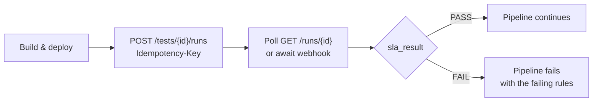

# 6. API

Base path `/api/v1`. OpenAPI at `/api/openapi.json`, Swagger UI at `/api/docs`,
generated by FastAPI.

**API-first:** anything the UI can do, the API can do. The UI is a client of the
same endpoints, with no privileged back channel.

## Versioning

`v1` contracts do not break. Additive change only — new optional fields, new
endpoints, new enum values that clients may ignore. Breaking change means `v2`
alongside `v1`, with a documented migration window.

## Authentication

```http
Authorization: Bearer <jwt>          # interactive users
Authorization: Bearer plim_live_...  # API keys, for CI and automation
```

## Error format

One shape everywhere:

```json
{
  "error": {
    "code": "TEST_NOT_RUNNABLE",
    "message": "No generator pool has sufficient capacity.",
    "details": { "requiredUsers": 5000, "availableUsers": 3200 },
    "requestId": "req-8f2a1c"
  }
}
```

`code` is stable and machine-readable. `message` is written for a human who has
to fix it — it says what happened and what to do, not just that something went
wrong. `requestId` correlates to logs and traces.

Validation failures return **all** problems at once. Fixing one field at a time
across seven round trips is a bad experience and worse in CI.

### Error codes

`code` values are part of the `v1` contract: append-only, never renamed, never
repurposed. The v0.1 catalogue:

| Code | HTTP | Meaning |
| --- | --- | --- |
| `VALIDATION_FAILED` | 422 | Request shape or field values invalid; `details` lists every problem |
| `UNAUTHENTICATED` | 401 | Missing or invalid credentials |
| `PERMISSION_DENIED` | 403 | Authenticated, but not permitted to do this |
| `NOT_FOUND` | 404 | Absent — or outside the caller's organisation, indistinguishable by design |
| `CONFLICT` | 409 | Optimistic-lock `version` mismatch on a concurrent edit |
| `IDEMPOTENCY_KEY_REUSED` | 409 | Same `Idempotency-Key`, different payload |
| `TEST_NOT_RUNNABLE` | 422 | Preflight failed; `details` carries every failing check |
| `TARGET_NOT_ALLOWED` | 422 | A resolved target host is outside the organisation's allowlist |
| `INSUFFICIENT_CAPACITY` | 422 | No generator pool can supply the requested virtual users |
| `REPO_UNREACHABLE` | 422 | Git host or credential failure during verify or ref resolution |
| `RATE_LIMITED` | 429 | Limit exhausted; honour `Retry-After` |
| `INTERNAL` | 500 | Unexpected fault; `requestId` is the support handle |

## Collections

Every list endpoint pages with an opaque cursor:

```http
GET /api/v1/runs?limit=50&cursor=eyJydW4iOi...
```

```json
{ "items": [ "..." ], "nextCursor": "eyJydW4iOi..." }
```

- `limit` defaults to 50, capped at 200. `nextCursor` is `null` on the last
  page. Cursors are opaque; clients never construct or parse one.
- Cursor pagination rather than offset, because run history grows without
  bound and offset pagination skips or duplicates rows when inserts land
  mid-scan — which, on a busy control plane, is always.
- Filters are per-endpoint query parameters combined with AND:
  `GET /runs?status=RUNNING&projectId={id}&since=2026-08-01T00:00:00Z`.
- `sort` takes a documented field name, `-`-prefixed for descending. The
  default is newest first.

## Endpoints

### Auth
```http
POST /auth/login
POST /auth/logout
POST /auth/refresh
GET  /auth/me
```

### Projects
```http
GET    /projects
POST   /projects
GET    /projects/{id}
PATCH  /projects/{id}
DELETE /projects/{id}
```

### Script repositories
```http
GET    /projects/{projectId}/script-repos
POST   /projects/{projectId}/script-repos
GET    /script-repos/{id}
PATCH  /script-repos/{id}
DELETE /script-repos/{id}

POST   /script-repos/{id}/verify        # test credentials, resolve ref, read plan
GET    /script-repos/{id}/versions      # resolved commits
POST   /script-repos/{id}/versions      # pin a ref to a commit SHA
GET    /script-versions/{id}
```

`verify` is the endpoint that makes Git-sourced plans usable: it confirms the
credential works, resolves the ref, and reports what it found — thread groups,
transaction controllers, referenced data files, required plugins — before anyone
tries to run it. Validation runs against the repository's `plimsoll.yaml`
manifest where present; [script repositories](07-script-repos.md) defines the
contract.

### Performance tests
```http
GET    /projects/{projectId}/tests
POST   /projects/{projectId}/tests
GET    /tests/{id}
PATCH  /tests/{id}
DELETE /tests/{id}

POST   /tests/{id}/validate     # preflight without running
POST   /tests/{id}/clone
POST   /tests/{id}/schedule
POST   /tests/{id}/runs         # start a run
```

`PATCH /tests/{id}` requires the current `version` and returns `409` on a
concurrent edit rather than overwriting.

### Runs
```http
GET  /runs
GET  /runs/{id}
GET  /runs/{id}/status
GET  /runs/{id}/metrics
GET  /runs/{id}/transactions
GET  /runs/{id}/errors
GET  /runs/{id}/generators
GET  /runs/{id}/artifacts
POST /runs/{id}/stop
POST /runs/{id}/cancel
```

`stop` and `cancel` are idempotent — repeating them on a finished run returns
`200` with current state, never an error and never a second side effect.

### Generator pools
```http
GET    /generator-pools
POST   /generator-pools
GET    /generator-pools/{id}
PATCH  /generator-pools/{id}
DELETE /generator-pools/{id}
POST   /generator-pools/{id}/test-connection
```

### Baselines, reports, admin
```http
POST /projects/{projectId}/baselines
GET  /projects/{projectId}/baselines
GET  /runs/{id}/compare?baseline={baselineId}

POST /runs/{id}/reports
GET  /reports/{id}
GET  /reports/{id}/download

GET  /audit-logs
GET  /api-keys
POST /api-keys
DELETE /api-keys/{id}
GET  /target-policy
PUT  /target-policy
```

## Idempotency

Any state-changing request accepts an `Idempotency-Key`. **CI clients should
always send one**, because a retried pipeline step must not start a second load
test.

```http
POST /api/v1/tests/{id}/runs
Authorization: Bearer plim_live_...
Idempotency-Key: build-4821
```

```json
{ "runId": "run-2026-000456", "runNumber": 456, "status": "QUEUED" }
```

Replaying the same key returns the original response. Replaying it with a
different payload returns `409` — that is a client bug worth surfacing, not
something to silently resolve.

## WebSocket

```
/ws/runs/{runId}
```

```json
{
  "type": "metric",
  "runId": "run-2026-000123",
  "timestamp": "2026-08-10T10:00:00Z",
  "metric": {
    "activeUsers": 1250,
    "throughput": 840,
    "p95": 720,
    "errorRate": 0.4
  }
}
```

Events: `run.started`, `run.running`, `metric`, `transaction.metric`,
`generator.status`, `sla.violation`, `run.warning`, `run.failed`,
`run.completed`. Terminal events invalidate the matching TanStack Query caches
so the UI converges without polling.

Authentication happens on connect; subscriptions are authorised per run.

## CI integration



Webhook events: `run.started`, `run.completed`, `run.failed`, `sla.failed`.
Payloads are signed with an HMAC the receiver verifies.

Generic API and webhook support comes first; Jenkins, GitHub Actions, GitLab CI,
and Azure DevOps ship as thin wrappers over it rather than as separate
integrations with their own semantics.

## CLI

```bash
plimsoll login
plimsoll test run <test>        # honours --wait and exits non-zero on SLA failure
plimsoll run status <run>
plimsoll run wait <run>
plimsoll report download <run>
```

The CLI is an API client with no special privileges. `plimsoll test run --wait`
is the single command a pipeline needs.

## Rate limits

Per principal and per organisation, returned as `X-RateLimit-*` headers with
`429` and `Retry-After` on exhaustion. Run-creation limits are separate and
tighter than read limits — starting load tests is the expensive operation, and
the one worth throttling.

## Health and version

```http
GET /healthz          # liveness — the process is up; checks nothing else
GET /readyz           # readiness — PostgreSQL, Redis, object storage reachable
GET /api/v1/version   # build version, git SHA, supported API revisions
```

`/healthz` and `/readyz` sit outside `/api/v1` and are unauthenticated, for
load balancers and Kubernetes probes; the worker exposes the same two. Ready
failing while live passes means up-but-degraded — route traffic away, do not
restart.
